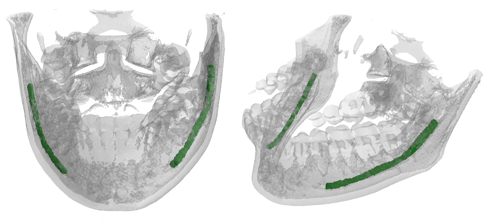

Improving Segmentation of the Inferior Alveolar Nerve through Deep Label Propagation
========
<figure>
 
 <figcaption><em>Front and side views of a densely annotated IAN</em></figcaption>
</figure>


## Introduction
This repository contains the material from the paper "Improving Segmentation of
the Inferior Alveolar Nerve through Deep Label Propagation". In particular, this
repo is dedicated to the 3D neural networks used to generate and segment the
Inferior Alveolar Nerve (IAN).
This nerve is oftentimes in close relation
to the roots of molars, and its position must thus be carefully
detailed before the surgical removal. As avoiding contact
with the IAN is a primary concern during these operations,
segmentation plays a key role in surgical preparations.

## Citing our work
[BibText](https://federicobolelli.it/pub_files/2022cvpr.html)

## IAN Segmentation and Label Propagation
For the IAN segmentation, we adopted a modified version of U-NET 3D, enriched
with a 2 pixels padding and an embedding of the coordinates of the sub-volumes
fed in the net. Because of the heavy burden represented by manual annotation of
segmentation ground thruth we also employed the same neural network to expand
our dataset by having a dense annotation for all the volumes in our dataset in
order to have more data for the training phase of the main task. The training
phase of the segmentation network, is divided in 2 phase: first we use the
sparse annotations with their generated ground thruth as a pretraining and then
the real dense annotation as a finetuning.

## Dataset
Before running this project, you need to [download](http://ditto.ing.unimore.it)
the dataset. Also look at
[this](https://github.com/AImageLab-zip/New-Maxillo-Dataset-Segmentation) which
has the code to generate the naive dense labels starting from the sparse
annotations (Circular Expansion)

## How to run
Clone this repository, create a python env for the project (optional) and
activate it. Then install all the dependencies with pip
```
git clone git@github.com:AImageLab-zip/alveolar_canal.git
cd alveolar_canal
python -m venv env
source env/bin/activate
pip install -r requirements.txt
```

### Run
Run the project as follows:
```
python main.py [-h] -c CONFIG [--verbose]

arguments:
  -h, --help            show this help message and exit
  -c CONFIG, --config CONFIG
                        the config file used to run the experiment
  --verbose             To log also to stdout
```
E.g. to run the generation experiment, execute:
```
python main.py --config configs/gen-training.yaml
```

## YAML config files
You can find the config files used to obtain the best result in the config folder.
Two files are needed: `experiment.yaml`, `augmentations.yaml`. For both the two
tasks, the best config file is provided:
- <b>gen-training.yaml</b> for the network which, from the sparse annotation, generate the dense labels
- <b>seg-pretrain.yaml</b> which train the segmentation network only over the generated labels
- <b>seg-finetuning.yaml</b> which train the segmentation network over the real dense labels
Execute `main.py` with these 3 configs in this order to reproduce our results

## Checkpoints
Download the pre-trained checkpoints [here](https://ditto.ing.unimore.it/maxillo/download/checkpoints)


### experiment.yaml
`experiment.yaml` describe each part of the project, like the
network/loss/optimizer, how to load data and so on:
```yaml
# title of the experiment
title: canal_generator_train
# Where to output everything, in this path a folder with
# the same name as the title is created containing checkpoints,
# logs and a copy of the config used
project_dir: '/path/to/results'
seed: 47

# which experiment to execute: Segmentation or Generation
experiment:
  name: Generation

data_loader:
  dataset: /path/to/maxillo
  # null to use training_set, generated to used the generated dataset
  training_set: null
  # which augmentations to use, see: augmentations.yaml
  augmentations: configs/augmentations.yaml
  background_suppression: 0
  batch_size: 2
  labels:
    BACKGROUND: 0
    INSIDE: 1
  mean: 0.08435
  num_workers: 8
  # shape of a single patch
  patch_shape:
  - 120
  - 120
  - 120
  # reshape of the whole volume before extracting the patches
  resize_shape:
  - 168
  - 280
  - 360
  sampler_type: grid
  grid_overlap: 0
  std: 0.17885
  volumes_max: 2100
  volumes_min: 0
  weights:
  - 0.000703
  - 0.999

# which network to use
model:
  name: PosPadUNet3D

loss:
  name: Jaccard

lr_scheduler:
  name: Plateau

optimizer:
  learning_rate: 0.1
  name: SGD

trainer:
  # Reload the last checkpoints?
  reload: True
  checkpoint: /path/to/checkpoints/last.pth
  # train the network
  do_train: True
  # do a single test of the network with the loaded checkpoints
  do_test: False
  # generate the synthetic dense dataset
  do_inference: False
  epochs: 100
```

### augmentations.yaml
`augmentations.yaml` defines which type of augmentations use during training.
Two different augmentations files have been used, one for the segmentation task,
one for the generation task.
The file should follow this structure:
```yaml
RandomAffine:
  scales: !!python/tuple [0.5, 1.5]
  degrees: !!python/tuple [10, 10]
  isotropic: false
  image_interpolation: linear
  p: 0.5
RandomFlip:
  axes: 2
  flip_probability: 0.7
```
